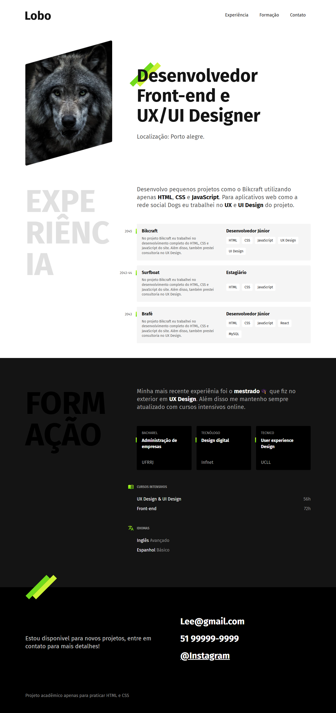
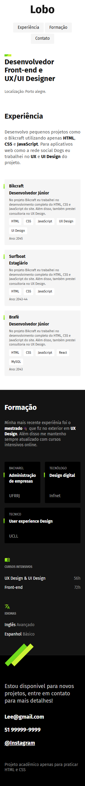

# Lobo portfolio!
## Projeto acadêmico

## Resumo

Temos uma landing page interativa e responsiva de um portfolio, onde foi usado HTML e CSS. 
(Projeto acadêmico)

## Tecnologias utilizadas

    
    

## Imagem completa do site
### Desktop

### Mobile

## Acesse o Projeto

Você pode acessar o projeto através do link abaixo:

➜ [Link do projeto Lobo](https://ezequiel-lee.github.io/lobo/)

## Agradecimentos

(Agradecimentos ao André da Origamid pelo conhecimento.)
